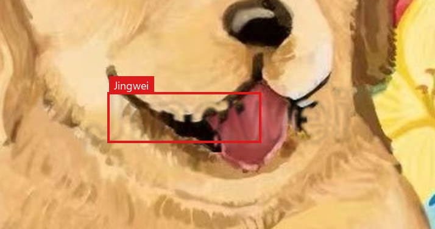
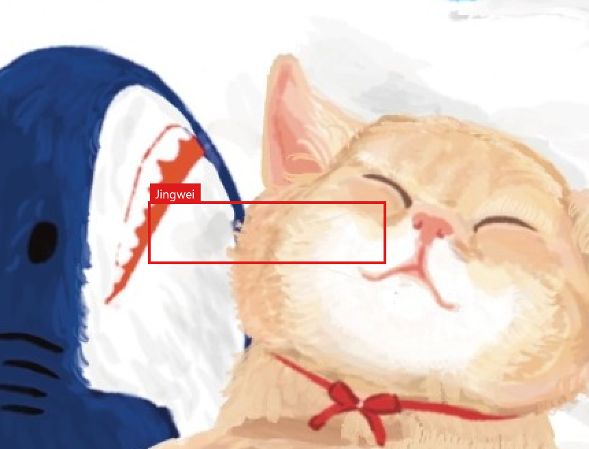

# Jingwei (Self-host)

<p align="left">
  <b>English</b> | <a href="README_zh.md">简体中文</a>
</p>

**Local layered marks; verify without originals.**

A local-first **image attribution and verification toolkit** for artists and digital creators — visible deterrents plus verifiable signals that raise the cost of unauthorized reuse and AI washout.

This repository provides the **standalone open-source self-host edition** of Jingwei. All processing runs entirely on your local machine — images are never uploaded to any remote server, and temporary files are discarded immediately after processing.

*(For cloud features, creator community, and managed tools, visit [jwprotect.com](https://jwprotect.com)). Features here may differ from the hosted site.*

Jingwei combines multi-layered attribution (invisible frequency-domain and spatial attribution signals, readable on the Verify suite) with visible deterrent layers (such as displacement and texture locks) that significantly raise the computational and manual cost of AI watermark-removal, inpainting, and unauthorized reuse.

## What you get

| Feature | Route | Description |
|---|---|---|
| **Protect Engine** | [`/protect`](http://127.0.0.1:8080/protect) | Upload artwork, pick a protection mode, fine-tune placement boxes and eraser/brush masks, and download protected copies (PNG / JPEG). No registration required. |
| **Holo-Card Export** | [`/protect`](http://127.0.0.1:8080/protect) | Showcase foil/glare tilting card preview on protected results, with one-click rendering export to animated `.mp4` video clips. |
| **Verify Suite** | [`/verify`](http://127.0.0.1:8080/verify) | Upload protected files to inspect and decode JW declarations, DWT frequency payloads, LSB steganography, tracking anchors, and EXIF/IPTC metadata. |
| **Layer Matrix** | [`/guide/watermark-matrix`](http://127.0.0.1:8080/guide/watermark-matrix) | Interactive side-by-side slider comparing 9 visible layer recipes before and after real AI removal attempts. |

Default Docker has **no** PyTorch. An optional adversarial protection stack (AdvProtect) is available as an overlay profile (see bottom of this document).

## Quick start

You need [Docker Desktop](https://www.docker.com/products/docker-desktop/) (Windows / macOS) with the Docker engine running, or Docker Engine on Linux.

```bash
git clone https://github.com/Jingwei-Protect/jingwei-selfhost.git
cd jingwei-selfhost
docker compose up --build
```

The initial build pulls base images and compiles the frontend. Once ready, open **http://127.0.0.1:8080** in your browser. Leave the terminal running; press `Ctrl+C` to stop the stack.

> **Hardware note:** Processing is CPU-intensive. Large images on laptops may take several seconds. Images with long edges exceeding 2560px are automatically scaled before processing. If port 8080 is already in use, update the host port mapping in `compose.yaml`.

## How to protect a file

1. Open http://127.0.0.1:8080/protect and upload your artwork (PNG, JPEG, or WebP).
2. Enter the **creator name** you want embedded in the claims (required when JW declaration is enabled).
3. Select a **base mode** (detailed below). Click **Generate preview** on the right. You can drag placement boxes, or use the eraser/brush to spare key focal areas such as faces or logos.
4. Click **Start protection** and download your protected PNG (lossless, required for LSB verification) or JPEG.
5. *(Optional)* Scroll down to the **Holo-Card preview** to interact with the foil/glare card, then click **Download Holo-Card clip (.mp4)** to export an animated showcase video.

### Base modes

- **Credit · Quick** — Designed for everyday online publishing. Embedding a creator name automatically writes an invisible verifiable JW declaration. The visible signature defaults to **Auto** (flat art → faint character grid; textured photos → displacement), or you can force **Faint characters** or **Displacement**. Extra visible layers can be configured under **More options**.
- **Manual** — Full control over every individual invisible and visible layer. Adjust opacity, font size, density, displacement strength, and logo placement independently.
- **Ultimate · Color** / **Ultimate · Grayscale** — Enhanced multi-layer defense recipes tailored for high-contrast color art or grayscale illustrations. Fine-tune options in **Ultimate mode settings**.

### Credit · Quick examples

Samples are for documentation purposes only ([SAMPLES-LICENSE.md](SAMPLES-LICENSE.md)).

At full scale, the protected image appears virtually unchanged. The second row displays the **same region enlarged**, with a red box highlighting the subtle watermark structure.

#### Textured art (fur, petals) → Auto selects displacement

Displacement nudges host pixels along the name's stroke paths rather than pasting an opaque color stamp.

| Before | After Credit · Quick |
|:---:|:---:|
|  |  |

| Same region enlarged (before) | Same region enlarged (after) |
|:---:|:---:|
|  |  |

#### Flat illustration → Auto selects faint characters

A light full-frame character grid combined with a faint dotted signature stamp.

| Before | After Credit · Quick |
|:---:|:---:|
|  |  |

| Same region enlarged (before) | Same region enlarged (after) |
|:---:|:---:|
|  |  |

### Invisible and tracking layers

These layers do not appear as visible stamps. Inspect and decode them on the **Verify** page.

| Layer | Appearance | Resilience against AI removal / re-encoding | Verify extraction |
|---|---|---|---|
| **JW Declaration** | Invisible | Resistant to moderate JPEG compression and screenshots; extensive AI repainting may degrade it. | Decodes creator signature, usage license, and timestamp. |
| **DWT Frequency** | Invisible | Frequency-domain payload (alphanumeric, max 24 chars). Outperforms LSB under JPEG compression. | Decodes exact embedded text payload. |
| **LSB Spatial** | Invisible | Lossless bit-plane embedding. **PNG originals only.** (Lost upon JPEG conversion or screenshots). | Decodes hidden bitstream. |
| **Tracking Anchors** | 4 faint corner marks | Recovers author code + year-month even after screenshot crops when matching the signature text used during protection. (Requires short edge ≥ 512px). | Recovers author code & timestamp. |
| **EXIF / IPTC** | Metadata | Preserved during direct file transfers; frequently stripped by social platforms. | Standard metadata inspection. |

### Visible layers (from the in-app matrix)

Visible layers are designed to introduce distortion and structural artifacts when AI inpainting or watermark removers attempt to erase them.

*Left column: after Jingwei protection. Right column: after an AI watermark-removal / local inpaint attempt. Red boxes highlight smears, blurring artifacts, residual markings, or damaged textures.*

Live interactive comparisons are available at http://127.0.0.1:8080/guide/watermark-matrix.

#### Displacement · tiled repeat

Host pixels under the repeated text grid are shifted while preserving original color. Erasing algorithms struggle to reconstruct the underlying continuous texture.

| After Jingwei protection | After AI repair attempt |
|:---:|:---:|
|  |  |

#### Displacement · scattered characters

Characters are distributed randomly across high-variance regions, disrupting local inpainting models and raising the cost of finding consistent edge alignments.

| After Jingwei protection | After AI repair attempt |
|:---:|:---:|
|  |  |

#### Displacement · grouped word

Concentrated word stamps placed over critical subjects. Position and bounding boxes can be freely adjusted on the preview canvas.

| After Jingwei protection | After AI repair attempt |
|:---:|:---:|
|  |  |

#### Tiled text overlay

Semi-transparent repeated typography. Provides high visual deterrence and copyright clarity.

| After Jingwei protection | After AI repair attempt |
|:---:|:---:|
|  |  |

#### Emboss texture

Subtle full-frame directional bevel hatches. Highly effective at causing inpainting tools to produce noticeable texture discontinuities.

| After Jingwei protection | After AI repair attempt |
|:---:|:---:|
|  |  |

#### Blur bar

Horizontal translucent defense bands. Ideal for portraits, commercial draft previews, or protecting sensitive composition elements.

| After Jingwei protection | After AI repair attempt |
|:---:|:---:|
|  |  |

#### Blur block

Custom brush-painted blur patches. Manually paint over sensitive regions directly on the interactive canvas.

| After Jingwei protection | After AI repair attempt |
|:---:|:---:|
|  |  |

#### ASCII characters

Full-frame faint character grid and optional micro-signatures. Creates dense high-frequency noise that disrupts edge detection.

| After Jingwei protection | After AI repair attempt |
|:---:|:---:|
|  |  |

#### Halftone dots

High-frequency dot patterns embedded in background gradients. AI smoothing operations leave unnatural flat patches.

| After Jingwei protection | After AI repair attempt |
|:---:|:---:|
|  |  |

*(Additional layers available on Protect: Face-emboss lock, Jumping Moire, and Displacement Logo silhouette).*

## How to verify

1. Open http://127.0.0.1:8080/verify and upload the protected file (use original PNG for LSB checks).
2. The verification engine automatically analyzes the file for C2PA manifests (when present), JW declarations, tracking anchors, DWT payloads, LSB content, and EXIF/IPTC metadata. The Verify page only **reads** existing, supported C2PA information; Jingwei's protect flow does **not** issue, write, or generate C2PA manifests.
3. For tracking anchors on cropped or screenshot images, enter the **exact creator signature** used during protection.

Detection results do not constitute legal proof of ownership, authenticity, or AI provenance.

## Support Jingwei

Self-host is free. If you want to fund continued work, tips go to the **Jingwei project**, not whoever is running this Docker instance:

- [Ko-fi](https://ko-fi.com/jingwei2026)

## License

- **Code:** [MIT](LICENSE) © 精卫 Jingwei
- **Sample images** (sample artwork and comparison pairs): **Not MIT.** [SAMPLES-LICENSE.md](SAMPLES-LICENSE.md). All rights reserved; documentation purposes only.

---

## Optional AdvProtect (Adversarial Defense)

The default Docker stack contains **no** PyTorch or heavyweight ML frameworks. 

An optional adversarial perturbation profile (AdvProtect) based on latent encoder/diffusion disruptions is provided for experimental research. Note that protection against closed-source commercial AI services (such as Doubao or Jimeng) is **not guaranteed** due to server-side image preprocessing and re-encoding.

To start with the adversarial profile:

```bash
docker compose down
docker compose -f compose.yaml -f compose.adv.yaml up --build
```

Detailed documentation: [docs/adv-protect-local.md](docs/adv-protect-local.md).
