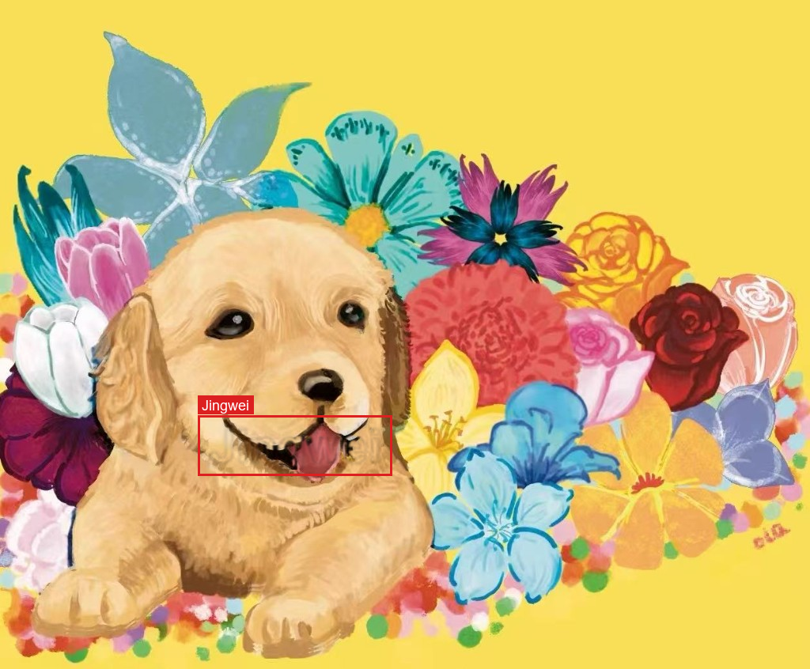
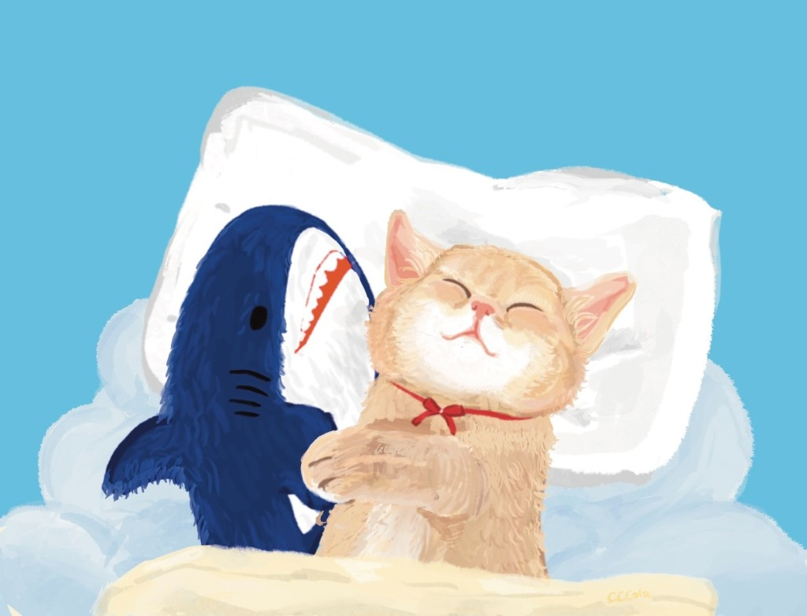
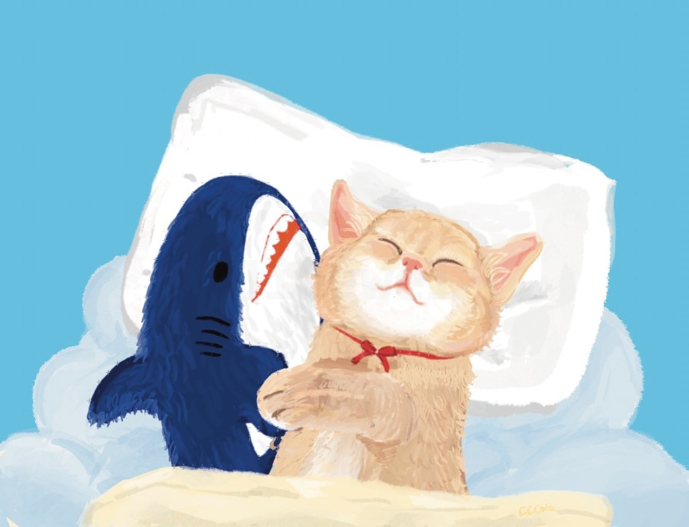
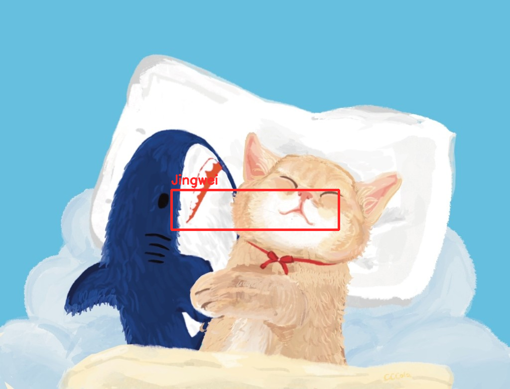

# 精卫自托管

这不是官网。官网：[jwprotect.com](https://jwprotect.com)。本仓库在你自己的电脑上跑**保护**和**验证**，上传的图不会发到官网。官网才是持续维护的产品（社区、赞助、最新界面）。

英文说明与安装以 [README.md](README.md) 为准。

## 能做什么

| 页面 | 作用 |
|------|------|
| **保护** | 把归属和防洗图层写入图片，然后下载。不用注册。 |
| **验证** | 读回这些层，检查你已经保护过的文件。 |

默认 Docker **不含** PyTorch。可选对抗保护是另一套镜像（见文末），**不出现在保护页**。

## 快速开始

需要已启动的 [Docker Desktop](https://www.docker.com/products/docker-desktop/)（Windows / macOS），或 Linux 上的 Docker Engine。

```bash
git clone https://github.com/Jingwei-Protect/jingwei-selfhost.git
cd jingwei-selfhost
docker compose up --build
```

第一次会拉基础镜像并编译前端，之后会快一些。

浏览器打开 **http://127.0.0.1:8080**。无需登录。

算图吃 CPU。笔记本上大图可能较慢。用的时候不要关这个终端；`Ctrl+C` 停止。

若 8080 已被占用，关掉占用的程序，或改 `compose.yaml` 里的端口映射。

## 样图长什么样

以下是**说明用样图**（不是 MIT），禁止当自己的画用。授权见 [SAMPLES-LICENSE.md](SAMPLES-LICENSE.md)。

### 小狗 — 有纹理的画，快捷署名

毛发和花瓣会被当成纹理，保护用轻位移把署名写进像素里，不是贴一层色块。

<p>


</p>

<p></p>

### 猫 — 平涂插画，快捷署名

平涂会加很浅的全图网点，再加浅色点状署名。远看仍是原画。

<p>


</p>

<p></p>

compose 起来之后，更多保护 vs AI 修复对照：http://127.0.0.1:8080/guide/watermark-matrix（文件在 `frontend/public/showcase/guide/`）。

## 许可证

- **代码：** [MIT](LICENSE) © 精卫 Jingwei
- **样图：不是 MIT。** 见 [SAMPLES-LICENSE.md](SAMPLES-LICENSE.md)。仅供说明，不能当素材、周边、作品集或训练数据。

## 可选对抗保护

不在保护页。默认镜像不含 torch。

对豆包等闭源改图做过**多轮实测**，成功率很低，经常几乎看不出防护。实验性选项，可能对部分开源扩散模型有用，**不能当作防豆包、即梦的承诺。**

和默认栈共用 **8080**，先停掉再开：

```bash
docker compose down
docker compose -f compose.yaml -f compose.adv.yaml up --build
```

导航里只有打开开关后才出现入口。说明：[docs/adv-protect-local.md](docs/adv-protect-local.md)。
