# 精卫自托管

这不是官网。官网：[jwprotect.com](https://jwprotect.com)。本仓库在你自己的电脑上跑**保护**、**验证**和**图层对照矩阵**，上传的图不会发到官网。官网才是持续维护的产品（社区、赞助、最新界面）。

英文以 [README.md](README.md) 为准。

精卫是分层归属工具：验证页能读回的隐形声明，加上可选的可见层，用来抬高 AI 洗图和随手盗用的成本。下面的实测**不是**对某一款改图工具的保证。

## 能做什么

| 打开 | 做什么 |
|------|--------|
| [保护](http://127.0.0.1:8080/protect) | 上传文件，选基础模式，预览，下载保护后的图。不用注册。 |
| [验证](http://127.0.0.1:8080/verify) | 上传已保护的文件，读 JW、DWT、LSB、追踪锚点和元数据。 |
| [图层对照](http://127.0.0.1:8080/guide/watermark-matrix) | 与本 README 同一组可见层对照，可拖滑杆。Docker 起来之后才能打开。 |

默认 Docker **不含** PyTorch。可选对抗保护在文末，**不出现在保护页**。

## 安装

需要已启动的 [Docker Desktop](https://www.docker.com/products/docker-desktop/)（Windows / macOS），或 Linux 上的 Docker Engine。

```bash
git clone https://github.com/Jingwei-Protect/jingwei-selfhost.git
cd jingwei-selfhost
docker compose up --build
```

第一次会拉基础镜像并编译前端。打开 **http://127.0.0.1:8080**。用的时候不要关这个终端；`Ctrl+C` 停止。

算图吃 CPU。笔记本上大图会慢。长边超过 2560px 会在上传前缩小。若 8080 已被占用，关掉占用的程序，或改 `compose.yaml` 里的端口。

## 怎么保护一张图

1. 打开 http://127.0.0.1:8080/protect ，上传作品（PNG / JPEG / WebP）。
2. 填写你希望写进声明的**创作者姓名**（开启 JW 时必填）。
3. 选择**基础模式**（见下）。在右侧生成预览；可拖虚线框，用橡皮擦或画笔避开脸和标志，再点**开始保护**。
4. 下载 PNG（无损，LSB 需要）或 JPEG。自己留好原图；服务端处理完即删上传。

### 基础模式

**署名·快速** — 日常发稿。填姓名后自动写入可验证的隐形 JW 声明。画面印记可选**自动**（平涂 → 浅字符网格；有纹理的照片 → 位移字），或强制**浅字符** / **位移字**。可选 Logo 只打很小的浅印。位移参数和其他可见层在**更多选项**里。

**手动调节** — 自己逐项打开隐形层和可见层，参数全部自己设。与「署名·快速」相互独立。Logo 的位置、大小、深浅都可以单独调。

**终极·彩色** / **终极·灰阶** — 针对彩色或灰阶作品的更强组合。选中后看**终极模式专属设置**。下载前仍要预览。

### 署名·快速长什么样

下面配图与矩阵里的图**同一显示宽度**。样图仅供说明（[SAMPLES-LICENSE.md](SAMPLES-LICENSE.md)）。

远看全图几乎看不出差别，所以每组都加了**红框定位**，再给出**同一区域放大**。这些静图和下面矩阵配图**同一显示宽度**。

有纹理的画（毛发、花瓣）→ 自动多半走**位移**：脸上的宿主像素被推进署名里，不是贴一层色块。

| 保护前 | 署名·快速之后 |
|:---:|:---:|
|  |  |

| 红框：署名在哪 | 该区域放大（保护后） |
|:---:|:---:|
|  | 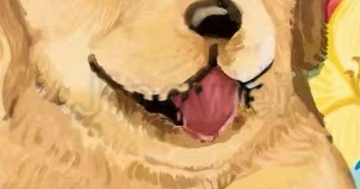 |

| 同一区域放大（保护前） | 同一区域放大（保护后） |
|:---:|:---:|
| 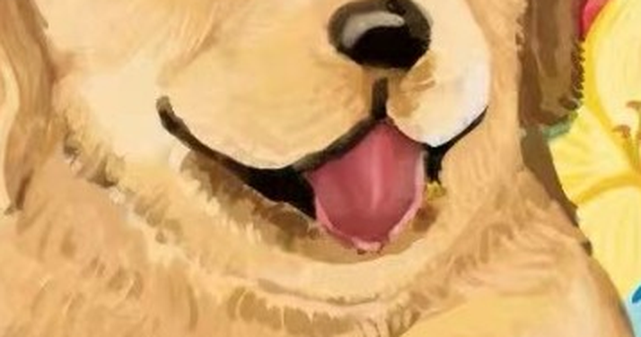 |  |

平涂插画 → 自动多半走**浅字符**：很浅的全图网点，再加一处点状署名。红框是点状署名；其余画面还有更浅的网点。

| 保护前 | 署名·快速之后 |
|:---:|:---:|
|  |  |

| 红框：署名在哪 | 该区域放大（保护后） |
|:---:|:---:|
|  |  |

| 同一区域放大（保护前） | 同一区域放大（保护后） |
|:---:|:---:|
| 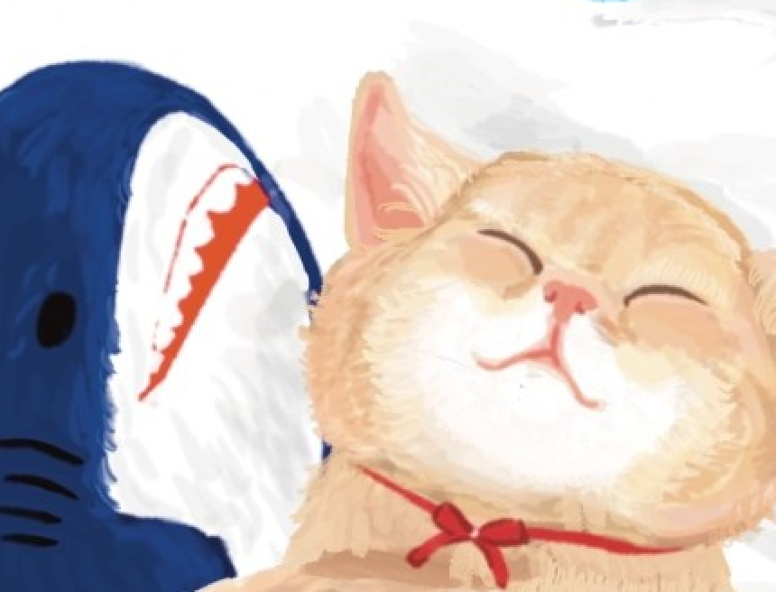 |  |

### 隐形层与追踪层

这些不会在画面上盖章，请到**验证**页查看。下表是实验室归纳，不是承诺。

| 图层 | 肉眼 | 常见 AI 洗图 / 重存之后 | 验证 |
|------|------|-------------------------|------|
| **精卫声明 JW** | 不可见。验证页可读页脚条与声明字段（创作者、限制、可选时间戳）。 | 轻度压缩、截图通常还在；全图 AI 重绘可能抹掉。 | 中–强 |
| **DWT 频域** | 不可见。载荷为字母数字符号，最多 24 字。与 JW 分开。 | 局部重绘可能削弱；重度重绘可能丢失。抗 JPEG 好于 LSB。 | 中 |
| **LSB 隐写** | 不可见。**只对原文件 PNG 有效。** | JPEG 重存、截图后容易失效。 | 弱–中 |
| **追踪锚点** | 四角极浅锚点。截图后若在验证页填入保护时用的**同一段署名**，仍可尝试读出作者码 + 年月。短边小于 512px 无法写入。 | 全图重绘可能失效；裁切图可能仍可追踪。 | 中 |

版权 **EXIF/IPTC** 元数据可选，社交平台常会剥掉。直传文件时再开。

### 可见层（与应用内说明矩阵相同）

可见层用来抬高盗用和洗图成本，**不能代替** JW / DWT 做归属举证。常用组合：**位移或半调 + JW + DWT**。人像可加模糊条或脸部浮雕锁。

左列：精卫加水印后。右列：AI 试图去水印 / 局部修复后。右侧红框来自使用指南，标出涂抹、色块、水印残留或结构错位。

对照与 http://127.0.0.1:8080/guide/watermark-matrix 相同（那里可以拖滑杆）。**摩尔纹**和**脸部浮雕锁**目前没有矩阵静图，请在保护页预览。

以下所有图片**同一宽度**。

#### 位移水印 · 铺满重复

文字区域里的像素被轻轻推开，颜色仍在。编辑器去字时，被推歪的结构很难无痕还原。

| 精卫加水印效果 | AI 试图修复后 |
|:---:|:---:|
| 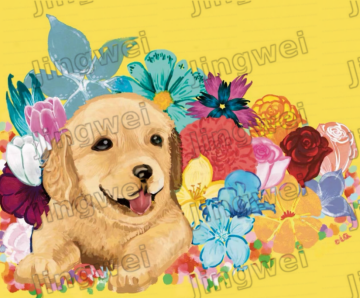 | 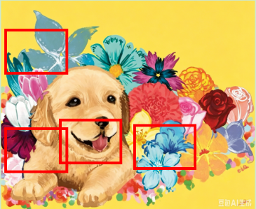 |

#### 位移水印 · 随机分散

字符打散后，局部重绘更难对齐原图纹理。

| 精卫加水印效果 | AI 试图修复后 |
|:---:|:---:|
| 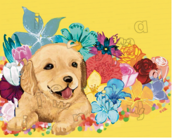 | 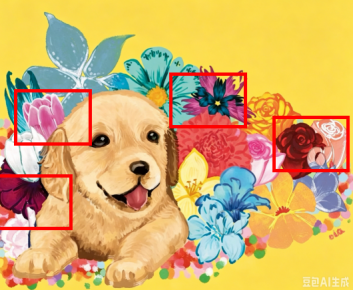 |

#### 位移水印 · 集中整词

一块或几块整词。保护页「集中整词」模式下可在预览上拖框。

| 精卫加水印效果 | AI 试图修复后 |
|:---:|:---:|
| 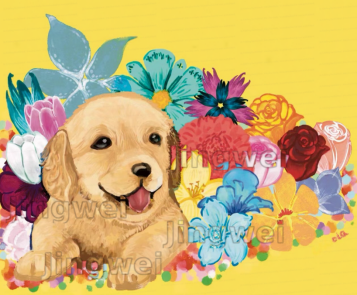 | 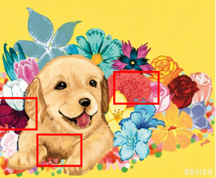 |

#### 平铺文字

画面上重复可读文字。比位移更显眼，摩擦也更高。

| 精卫加水印效果 | AI 试图修复后 |
|:---:|:---:|
| 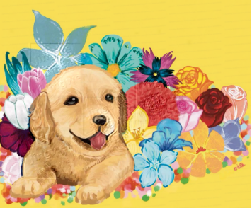 | 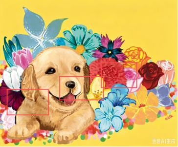 |

#### 浮雕纹理

全图轻微立体斜线纹。不太适合极简平涂，但能让局部修复看起来不对。

| 精卫加水印效果 | AI 试图修复后 |
|:---:|:---:|
| 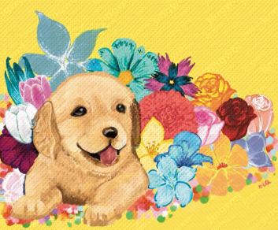 | 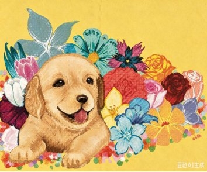 |

#### 模糊条

横向半透明条带。适合人像、交付预览、挡住一行字。保护页上最多五个虚线框，可拖可删。

| 精卫加水印效果 | AI 试图修复后 |
|:---:|:---:|
| 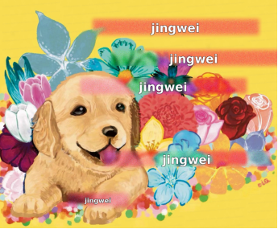 | 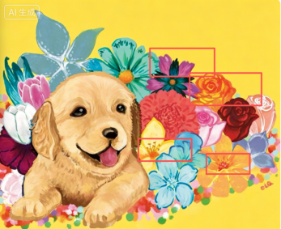 |

#### 模糊块

画笔涂抹的色块模糊，和「一条模糊带」不是同一层。在右侧预览上涂、撤销，再生成预览。

| 精卫加水印效果 | AI 试图修复后 |
|:---:|:---:|
| 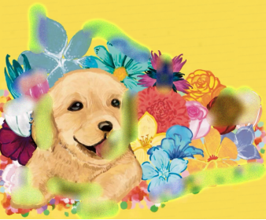 | 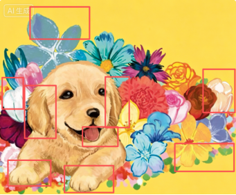 |

#### ASCII 水印

满屏浅字符网格（可加署名）。和位移不是一层。

| 精卫加水印效果 | AI 试图修复后 |
|:---:|:---:|
| 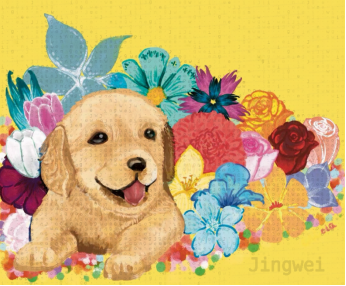 | 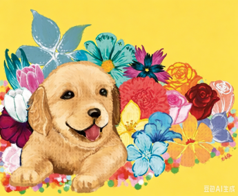 |

#### 半调网点

细点压进背景高频。编辑器一抹平，常常留下不自然的块面。

| 精卫加水印效果 | AI 试图修复后 |
|:---:|:---:|
| 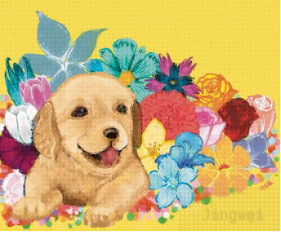 | 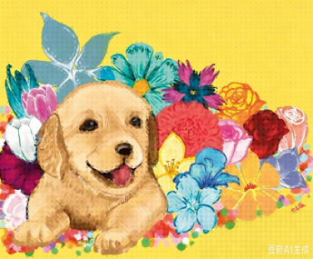 |

**保护页上还有、矩阵暂无静图：** 脸部浮雕锁、跳跃摩尔纹、可选的位移 **Logo**（用轮廓推动宿主像素，不是贴一张彩色图）。

## 怎么验证

1. 打开 http://127.0.0.1:8080/verify ，上传你**下载下来的保护文件**（LSB 请用 PNG，不要用截图）。
2. 选文件后自动检测。面板包括 C2PA（若有）、JW、追踪锚点、DWT、LSB、EXIF/IPTC。
3. 截图后再验追踪时，填保护时用的**同一段署名**（创作者名 / DWT / LSB / 浮雕 / ASCII 署名）。大小写和空格忽略，用词必须一致。

可见层不会显示成「已验证的声明」，它们是给人眼看的。

## 许可证

- **代码：** [MIT](LICENSE) © 精卫 Jingwei
- **样图**（署名示例和矩阵对照）：**不是 MIT。** [SAMPLES-LICENSE.md](SAMPLES-LICENSE.md)。仅供说明，不能当素材、周边、作品集或训练数据。

矩阵静图来自 2026 年使用指南与内部测试。改图工具会变。请对**你自己的文件**做预览和验证。红框不是针对某个产品的打分。

## 可选对抗保护

不在保护页。默认镜像不含 torch。

对豆包等闭源改图做过**多轮实测**，成功率很低，经常几乎看不出防护。实验性选项，可能对部分开源扩散模型有用，**不能当作防豆包、即梦的承诺。**

和默认栈共用 **8080**，先停掉再开：

```bash
docker compose down
docker compose -f compose.yaml -f compose.adv.yaml up --build
```

导航里只有打开开关后才出现入口。[docs/adv-protect-local.md](docs/adv-protect-local.md)。
